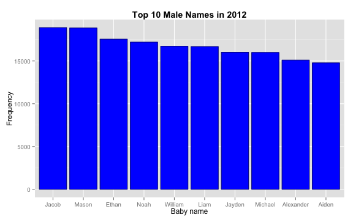

## What is this app about?

The "Baby Names" App is a handy little tool that allows you to visualize the most popular
baby names in the United States in the last decade. 


---

## Who should use it?

The Mission of this app is to help future parents make a better and more informed decision
related to that crucial aspect which is the naming of their children.

There are basically two kinds of future parents:

1. Those who like to be part of the general convention (i.e. fit in):
    + For them, this app allows them to choose a popular name.
2. Those who dislike being "part of the bunch" and thus, enjoy differentiating themselves:
    + For this segment, this app helps them prevent naming their kids with a conventional name.

---

## How does it look?

The app is pretty straightforward. You simply select the year, gender and rank. The output is
a graph that looks like this:

 

---

## What does it look like under the hood?

The graph in the previous slide was obtained from evaluating an embedded R code which was set to "echo=FALSE". Thus, the actual code is not displayed.
If you are interested in seeing the code (and to avoid confusion for my evaluator), you can see it below:

```
library(ggplot2)
bNames  <- read.csv("baby_names.csv")
mySub <- subset(bNames,Gender=="M" & Year==2012 , select=c(Name,Frequency))
sortIndex <- order(-mySub$Frequency)
topNames <- mySub[sortIndex[1:10],]
topNames$Name <- as.character(topNames$Name)
title <- paste("Top 10","Male","Names in","2012")
ggplot(topNames, aes(x= reorder(Name, -Frequency),Frequency)) +
    geom_bar(stat="identity", colour="darkblue", fill="blue") +
    xlab("Baby name") +
    ylab("Frequency") +
    ggtitle(title) +
    theme(plot.title = element_text(lineheight=0.8, face="bold"))
```


